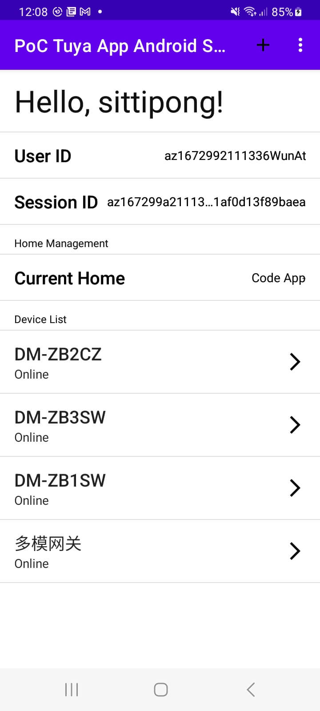

# PoC Smart Life SDK

A proof of concept (PoC) to use tuya app sdk


## Acknowledgements

 - [Tuya Docs](https://developer.tuya.com/en/docs/app-development/featureoverview?id=Ka69nt97vtsfu)
 - [Tuya Android SDK Sample Kotlin (Git Repo)](https://github.com/tuya/tuya-home-android-sdk-sample-kotlin)
 


## Requirement

- Android Studio Electric Eel | 2022.1.1
- JDK 11

## Installation

1. Clone this repo.
```bash
git clone <this repo url>
cd <this repo folder>
```

2. Copy image secret (to_s.bmp) to project.

```bash
cp <your to_s.bmp file> ./app/src/main/assets/to_s.bmp
```

3. Set `appKey` and `secretKey` at local.properties

4. Open project with Android Studio then `Build & Run` Android App.

## Screenshots


